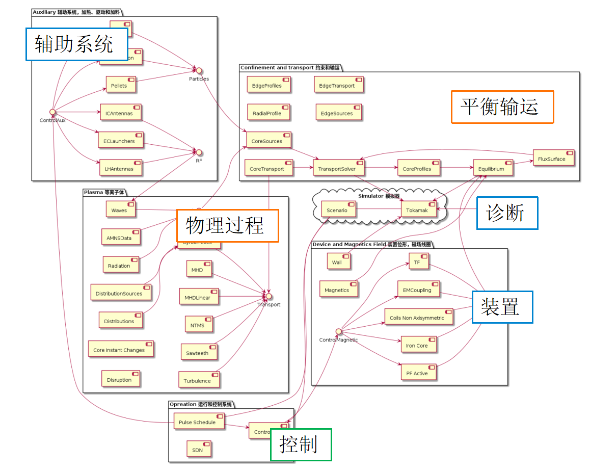

---
myst:
  substitutions:
    FyTok: _Fy_<font color="blue" />__Tok__
    SpDM: _Sp_<font color="blue" />__DM__
---

# 模块

## 状态树和 Actor

在构建托卡马克 Ontology 数据结构时，相互联系紧密的量形成一棵棵相对独立的树。通常这样的一棵树，会对应一个相对独立的物理概念或者装置组件，称为**Actor**，而这些量描述了 Actor 状态，称之状态树， 在单一时间点上的状态树时间片 （TimeSlice）。Actor 的状态会随时间或者迭代过程发生改变。从数据流角度来看，Actor 表述了一个 TimeSlice 演化构成的序列。从执行流角度来看，Actor 可以根据已有的 TimeSlice 和外部输入计算出新的 TimeSlice，更准确地说是 Actor 可以根据外部输入改变状态树。兼顾数据流和执行流， Actor 需要具有时间序列的管理功能，也要能够绑定物理程序实现状态树的演化和更新。存在一种可能，状态树构成的演化序列由外部数据源一次性给出，例如对应于诊断和控制的 Actor ，其状态序列是来源于实验诊断和控制指令的信号量 （Signal）。这时 Actor 的任务是从已有时间序列中查找到所需的时间点，分别截取数据，再整合成 TimeSlice。Actor 可以以 TimeSlice 的形式给出其在某一时间点上的状态。

```{note}
***时间片 TimeSlice 和信号 Signal:***
    Actor的状态随时间演化，在单一时刻状态的集合可称之为时间片 TimeSlice，由多个时间片按照时间顺序排列构成时间序列 TimeSeries 。一个Actor随时间演化，表现为由其状态树组成序列，这种数据结构称作 AoS，（Array of structure）。AoS 数据结构更适宜描述抽象物理概念的演化。当描述控制或诊断时，更多的是采用信号量（Signal）的形式。信号量是由等长的时间序列和物理量的序列组成，物理量可以是标量也可以是矢量或者矩阵。这时 Actor 的状态表述为一组信号组成的树，对应的数据结构称为 SoA（Structure of Array）。 AoS 和 SoA 两种结构分别适用于不同的数据抽象，可以相互转换。
```

托卡马克 Ontology 规定了 Actor 的物理含义，同时也就明确 Actor 之间的*依赖关系*。这里的*依赖关系*可以理解为，当 Actor 更新其状态时需要其他 Actor 的状态作为输入。若将 Actor 视为一个函数，_依赖关系_ 定义了其输入参数，输出则写入而描述 Actor 当前状态的 TimeSlice 中。可以将 Ontology 对 Actor 的语义和依赖关系的表述，视作对物理程序 API 的约定。在实际的集成过程中，{{FyTok}} 根据具体程序物理语义将其绑定到对应的 Actor 上，由 Actor 将符合 Ontology 描述的数据转发给外部程序，并收集其输出，转换为同样符合 Ontology 描述的数据结构。

## 托卡马克 Ontology 的模块划分

IMAS DD 中最上层的树状结构被称为 IDS（Interface Data structure ）。IMAS 包含近百各 IDS，根据其语义可以分解为以下几各大类（catalogy）：

- 用以描述物理概念和过程：
  - 平衡输运：equilibrium, core_profiles, core_transport, core_sources...
  - 物理过程：wave, MHD, turbulence...
- 用以描述装置中独立的子系统
  - 装置: wall, pf_active...
  - 诊断 : ECE, Langmuir Probes , Polarimeter...
  - 辅助系统: LH Antennas, ECLauhchers,IC Antennas, NBI, Pellets...
- 用以描述装置运行过程参数：
  - 控制系统: Pulse Schedule , Control

托卡马克的状态演化，可以理解为概略的描述为这几大类 IDS 之间的相互作用结果


更详细的结构如下



## `class Module(Actor)`

IMAS IDS 大多可以直接作为 Actor。其中，少部分是包含多个 Actor 的集合。如 `core_transport.model`，每个 `model` 对应一个 Actor。在 {{FyTok}} 实现中，按照 IDS 构建的 Module 在路径 `fytok.modules`下，其中包含两个基类：
- `fytok.modules.Utilities.Module`, 继承自 `spdm.data.Actor`, 增加 `Module.code` 属性（修改自 IDS.code），是所有模块的基类。
- `fytok.modules.Utilities.IDS`, 继承自 `fytok.modules.Utilities.Module`, 增加 `ids_properties` 属性，符合 IDS 结构。

详见下表：

```{eval-rst}

.. inheritance-diagram::  fytok.modules.Utilities.IDS
   :top-classes: spdm.data.Actor.Actor

.. autoclass:: fytok.modules.Utilities.Code
   :members: name,parameters, commit， version， copyright ， repository， output_flag， library

.. autoclass:: fytok.modules.Utilities.Module
    :members: code,refresh,time_slice,current,previous,time,iteration,register
    :undoc-members: time_slice
    :member-order: bysource
    :show-inheritance: True

.. autoclass:: fytok.modules.Utilities.IDS
    :members: ids_properties
    :member-order: bysource
    :show-inheritance: True
```
